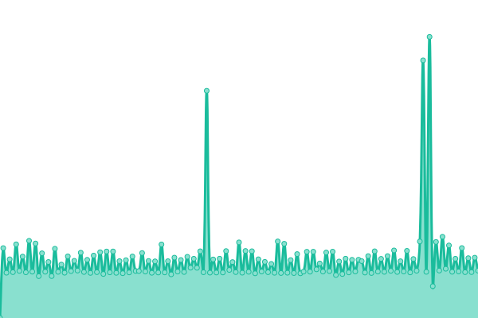

# [📈 Live Status](https://felipepita.github.io/upptime): <!--live status--> **🟧 Partial outage**

This repository contains the open-source uptime monitor and status page for [felipepita](https://felipepita.github.io/upptime), powered by [Upptime](https://github.com/upptime/upptime).

With [Upptime](https://upptime.js.org), you can get your own unlimited and free uptime monitor and status page, powered entirely by a GitHub repository. We use [Issues](https://github.com/felipepita/upptime/issues) as incident reports, [Actions](https://github.com/felipepita/upptime/actions) as uptime monitors, and [Pages](https://felipepita.github.io/upptime) for the status page.

<!--start: status pages-->
<!-- This summary is generated by Upptime (https://github.com/upptime/upptime) -->
<!-- Do not edit this manually, your changes will be overwritten -->
<!-- prettier-ignore -->
| URL | Status | History | Response Time | Uptime |
| --- | ------ | ------- | ------------- | ------ |
|  [Bug Busters](https://bugbusters.com.br) | 🟥 Down | [bug-busters.yml](https://github.com/felipepita/upptime/commits/HEAD/history/bug-busters.yml) | 

 166ms
     
 | 

<a href="https://felipepita.github.io/upptime/history/bug-busters">0.00%</a>
    

|  [MontarSite](https://montarsite.com.br) | 🟩 Up | [montar-site.yml](https://github.com/felipepita/upptime/commits/HEAD/history/montar-site.yml) | 

 376ms
     
 | 

<a href="https://felipepita.github.io/upptime/history/montar-site">100.00%</a>
    

|  [Chromatox](https://chromatox.com.br) | 🟩 Up | [chromatox.yml](https://github.com/felipepita/upptime/commits/HEAD/history/chromatox.yml) | 

 2234ms
     
 | 

<a href="https://felipepita.github.io/upptime/history/chromatox">100.00%</a>
    

|  [CCIH](https://ccih.med.br) | 🟥 Down | [ccih.yml](https://github.com/felipepita/upptime/commits/HEAD/history/ccih.yml) | 

 169ms
     
 | 

<a href="https://felipepita.github.io/upptime/history/ccih">0.00%</a>
    

|  [LP - Guarda Bens](https://guardabens-lp1.com.br) | 🟩 Up | [lp-guarda-bens.yml](https://github.com/felipepita/upptime/commits/HEAD/history/lp-guarda-bens.yml) | 

 394ms
     
 | 

<a href="https://felipepita.github.io/upptime/history/lp-guarda-bens">100.00%</a>
    

|  [E-fish](https://efish.com.br) | 🟩 Up | [e-fish.yml](https://github.com/felipepita/upptime/commits/HEAD/history/e-fish.yml) | 

 14447ms
     
 | 

<a href="https://felipepita.github.io/upptime/history/e-fish">100.00%</a>
    

|  [Boleto Bradesco](https://cobranca.bradesconetempresa.b.br) | 🟨 Degraded | [boleto-bradesco.yml](https://github.com/felipepita/upptime/commits/HEAD/history/boleto-bradesco.yml) | 

 1047ms
     
 | 

<a href="https://felipepita.github.io/upptime/history/boleto-bradesco">0.00%</a>
    

|  [Aulas Online CCIH](https://aulasonline.ccih.med.br) | 🟩 Up | [aulas-online-ccih.yml](https://github.com/felipepita/upptime/commits/HEAD/history/aulas-online-ccih.yml) | 

 1045ms
     
 | 

<a href="https://felipepita.github.io/upptime/history/aulas-online-ccih">100.00%</a>
    

|  [VB ALIMENTOS](https://vbalimentos.com.br/) | 🟩 Up | [vb-alimentos.yml](https://github.com/felipepita/upptime/commits/HEAD/history/vb-alimentos.yml) | 

 1169ms
     
 | 

<a href="https://felipepita.github.io/upptime/history/vb-alimentos">100.00%</a>
    

<!--end: status pages-->

[**Visit our status website →**](https://felipepita.github.io/upptime)

## 📄 License

- Powered by: [Upptime](https://github.com/upptime/upptime)
- Code: [MIT](./LICENSE) © [felipepita](https://felipepita.github.io/upptime)
- Data in the `./history` directory: [Open Database License](https://opendatacommons.org/licenses/odbl/1-0/)
