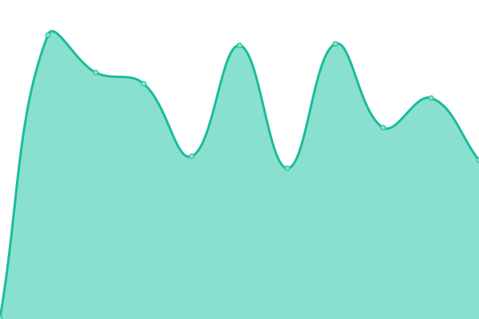
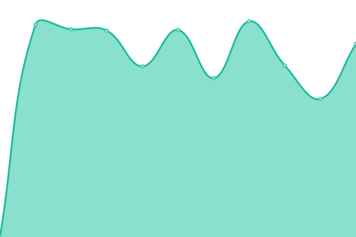

# [📈 Live Status](https://felipepita.github.io/upptime): <!--live status--> **🟨 Degraded performance**

This repository contains the open-source uptime monitor and status page for [felipepita](https://felipepita.github.io/upptime), powered by [Upptime](https://github.com/upptime/upptime).

With [Upptime](https://upptime.js.org), you can get your own unlimited and free uptime monitor and status page, powered entirely by a GitHub repository. We use [Issues](https://github.com/felipepita/upptime/issues) as incident reports, [Actions](https://github.com/felipepita/upptime/actions) as uptime monitors, and [Pages](https://felipepita.github.io/upptime) for the status page.

<!--start: status pages-->
<!-- This summary is generated by Upptime (https://github.com/upptime/upptime) -->
<!-- Do not edit this manually, your changes will be overwritten -->
<!-- prettier-ignore -->
| URL | Status | History | Response Time | Uptime |
| --- | ------ | ------- | ------------- | ------ |
| [Bug Busters](https://bugbusters.com.br) | 🟩 Up | [bug-busters.yml](https://github.com/felipepita/upptime/commits/master/history/bug-busters.yml) | 

 280ms
     
 | 

   

| [MontarSite](https://montarsite.com.br) | 🟩 Up | [montar-site.yml](https://github.com/felipepita/upptime/commits/master/history/montar-site.yml) | 

 309ms
     
 | 

   

| [Chromatox](https://chromatox.com.br) | 🟩 Up | [chromatox.yml](https://github.com/felipepita/upptime/commits/master/history/chromatox.yml) | 

 3107ms
     
 | 

   

| [CCIH](https://ccih.med.br) | 🟩 Up | [ccih.yml](https://github.com/felipepita/upptime/commits/master/history/ccih.yml) | 

 1089ms
     
 | 

   

| [LP - Guarda Bens](https://guardabens-lp1.com.br) | 🟩 Up | [lp-guarda-bens.yml](https://github.com/felipepita/upptime/commits/master/history/lp-guarda-bens.yml) | 

 657ms
     
 | 

   

| [E-fish](https://efish.com.br) | 🟨 Degraded | [e-fish.yml](https://github.com/felipepita/upptime/commits/master/history/e-fish.yml) | 

 8761ms
     
 | 

   

<!--end: status pages-->

[**Visit our status website →**](https://felipepita.github.io/upptime)

## 📄 License

- Powered by: [Upptime](https://github.com/upptime/upptime)
- Code: [MIT](./LICENSE) © [felipepita](https://felipepita.github.io/upptime)
- Data in the `./history` directory: [Open Database License](https://opendatacommons.org/licenses/odbl/1-0/)
