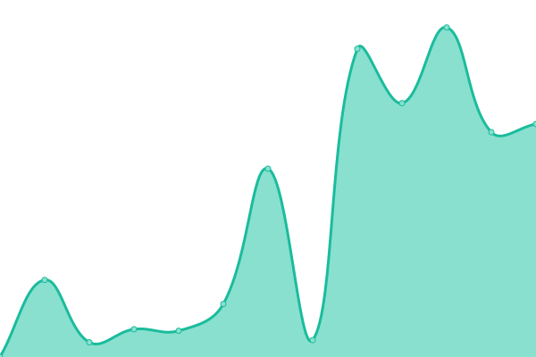

# [📈 Live Status](https://felipepita.github.io/upptime): <!--live status--> **🟧 Partial outage**

This repository contains the open-source uptime monitor and status page for [felipepita](https://felipepita.github.io/upptime), powered by [Upptime](https://github.com/upptime/upptime).

With [Upptime](https://upptime.js.org), you can get your own unlimited and free uptime monitor and status page, powered entirely by a GitHub repository. We use [Issues](https://github.com/felipepita/upptime/issues) as incident reports, [Actions](https://github.com/felipepita/upptime/actions) as uptime monitors, and [Pages](https://felipepita.github.io/upptime) for the status page.

<!--start: status pages-->
<!-- This summary is generated by Upptime (https://github.com/upptime/upptime) -->
<!-- Do not edit this manually, your changes will be overwritten -->
<!-- prettier-ignore -->
| URL | Status | History | Response Time | Uptime |
| --- | ------ | ------- | ------------- | ------ |
|  [Bug Busters](https://bugbusters.com.br) | 🟥 Down | [bug-busters.yml](https://github.com/felipepita/upptime/commits/HEAD/history/bug-busters.yml) | 

 167ms
     
 | 

<a href="https://felipepita.github.io/upptime/history/bug-busters">100.00%</a>
    

|  [MontarSite](https://montarsite.com.br) | 🟩 Up | [montar-site.yml](https://github.com/felipepita/upptime/commits/HEAD/history/montar-site.yml) | 

 381ms
     
 | 

<a href="https://felipepita.github.io/upptime/history/montar-site">100.00%</a>
    

|  [Chromatox](https://chromatox.com.br) | 🟩 Up | [chromatox.yml](https://github.com/felipepita/upptime/commits/HEAD/history/chromatox.yml) | 

 3375ms
     
 | 

<a href="https://felipepita.github.io/upptime/history/chromatox">100.00%</a>
    

|  [CCIH](https://ccih.med.br) | 🟥 Down | [ccih.yml](https://github.com/felipepita/upptime/commits/HEAD/history/ccih.yml) | 

 170ms
     
 | 

<a href="https://felipepita.github.io/upptime/history/ccih">100.00%</a>
    

|  [E-fish](https://efish.com.br) | 🟩 Up | [e-fish.yml](https://github.com/felipepita/upptime/commits/HEAD/history/e-fish.yml) | 

 8528ms
     
 | 

<a href="https://felipepita.github.io/upptime/history/e-fish">53.22%</a>
    

|  [Aulas Online CCIH](https://aulasonline.ccih.med.br) | 🟩 Up | [aulas-online-ccih.yml](https://github.com/felipepita/upptime/commits/HEAD/history/aulas-online-ccih.yml) | 

 851ms
     
 | 

<a href="https://felipepita.github.io/upptime/history/aulas-online-ccih">100.00%</a>
    

|  [JAMAICA MANGUEIRAS](https://jamaicamangueiras.com.br) | 🟩 Up | [jamaica-mangueiras.yml](https://github.com/felipepita/upptime/commits/HEAD/history/jamaica-mangueiras.yml) | 

 3319ms
     
 | 

<a href="https://felipepita.github.io/upptime/history/jamaica-mangueiras">100.00%</a>
    

|  [SISTEMA LARANJA](http://laranja.app.br/) | 🟩 Up | [sistema-laranja.yml](https://github.com/felipepita/upptime/commits/HEAD/history/sistema-laranja.yml) | 

 714ms
     
 | 

<a href="https://felipepita.github.io/upptime/history/sistema-laranja">100.00%</a>
    

|  [AVC2023](https://avc2023.com.br/) | 🟩 Up | [avc-2023.yml](https://github.com/felipepita/upptime/commits/HEAD/history/avc-2023.yml) | 

 3679ms
     
 | 

<a href="https://felipepita.github.io/upptime/history/avc-2023">100.00%</a>
    

|  [COLOPROCTO 2023](https://coloprocto2023.com.br/) | 🟩 Up | [coloprocto-2023.yml](https://github.com/felipepita/upptime/commits/HEAD/history/coloprocto-2023.yml) | 

 1812ms
     
 | 

<a href="https://felipepita.github.io/upptime/history/coloprocto-2023">100.00%</a>
    

|  [ECIP 2023](https://www.ecip.com.br/) | 🟩 Up | [ecip-2023.yml](https://github.com/felipepita/upptime/commits/HEAD/history/ecip-2023.yml) | 

 2729ms
     
 | 

<a href="https://felipepita.github.io/upptime/history/ecip-2023">100.00%</a>
    

|  [Naville](https://www.naville.com.br/) | 🟥 Down | [naville.yml](https://github.com/felipepita/upptime/commits/HEAD/history/naville.yml) | 

 3023ms
     
 | 

<a href="https://felipepita.github.io/upptime/history/naville">98.60%</a>
    

|  [LARCON Site](https://larcon.com.br/) | 🟩 Up | [larcon-site.yml](https://github.com/felipepita/upptime/commits/HEAD/history/larcon-site.yml) | 

 1986ms
     
 | 

<a href="https://felipepita.github.io/upptime/history/larcon-site">99.79%</a>
    

|  [LARCON Sistema](https://arquivo.larcon.com.br/) | 🟥 Down | [larcon-sistema.yml](https://github.com/felipepita/upptime/commits/HEAD/history/larcon-sistema.yml) | 

 0ms
     
 | 

<a href="https://felipepita.github.io/upptime/history/larcon-sistema">0.00%</a>
    

<!--end: status pages-->

[**Visit our status website →**](https://felipepita.github.io/upptime)

## 📄 License

- Powered by: [Upptime](https://github.com/upptime/upptime)
- Code: [MIT](./LICENSE) © [felipepita](https://felipepita.github.io/upptime)
- Data in the `./history` directory: [Open Database License](https://opendatacommons.org/licenses/odbl/1-0/)
